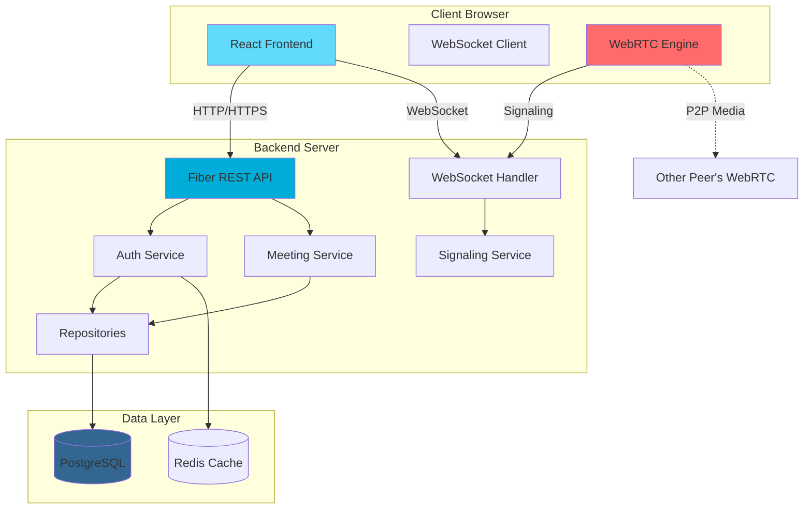
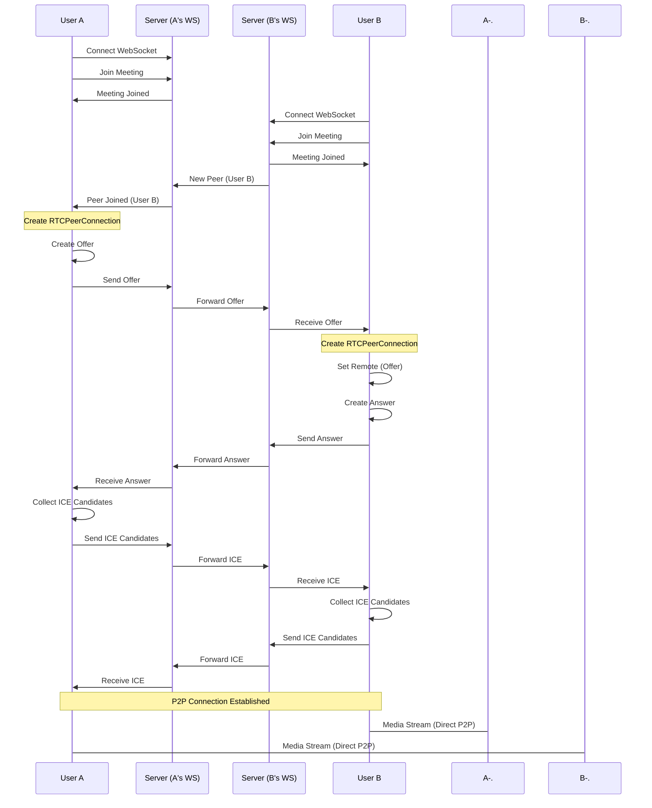
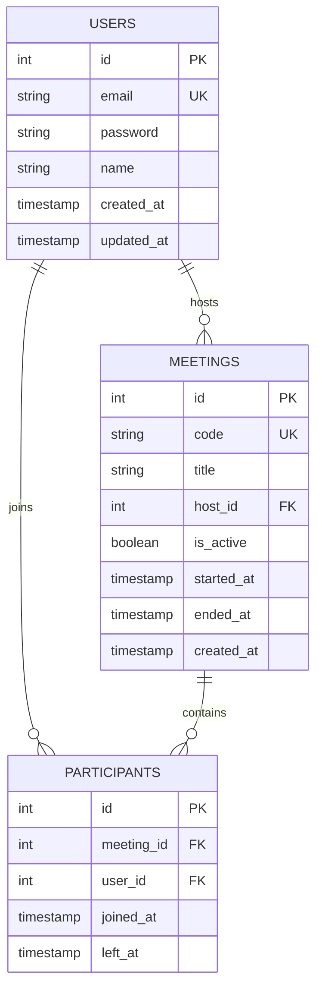
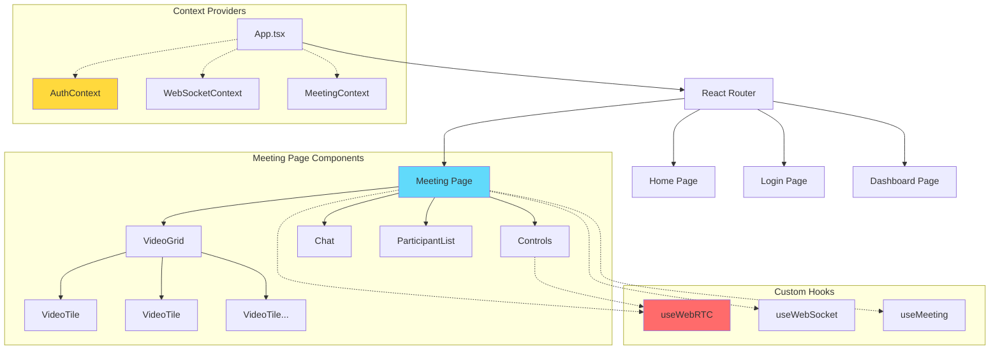
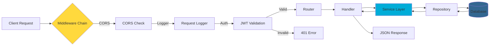
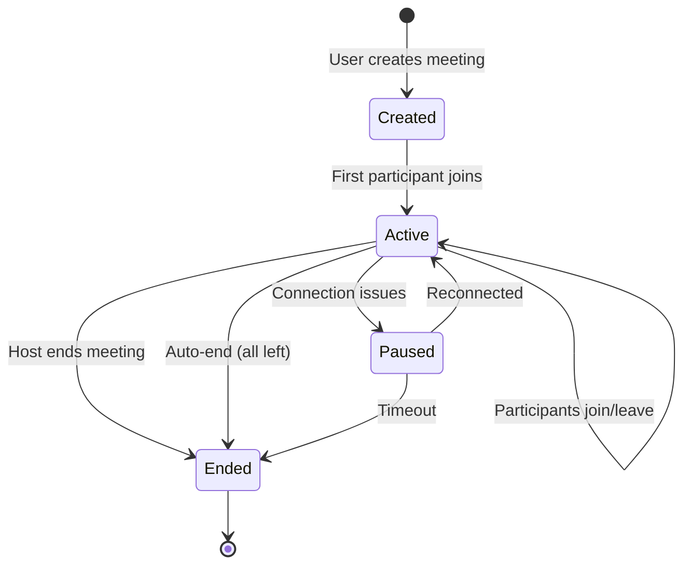
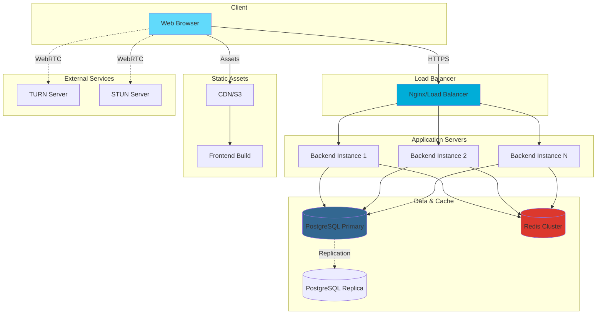
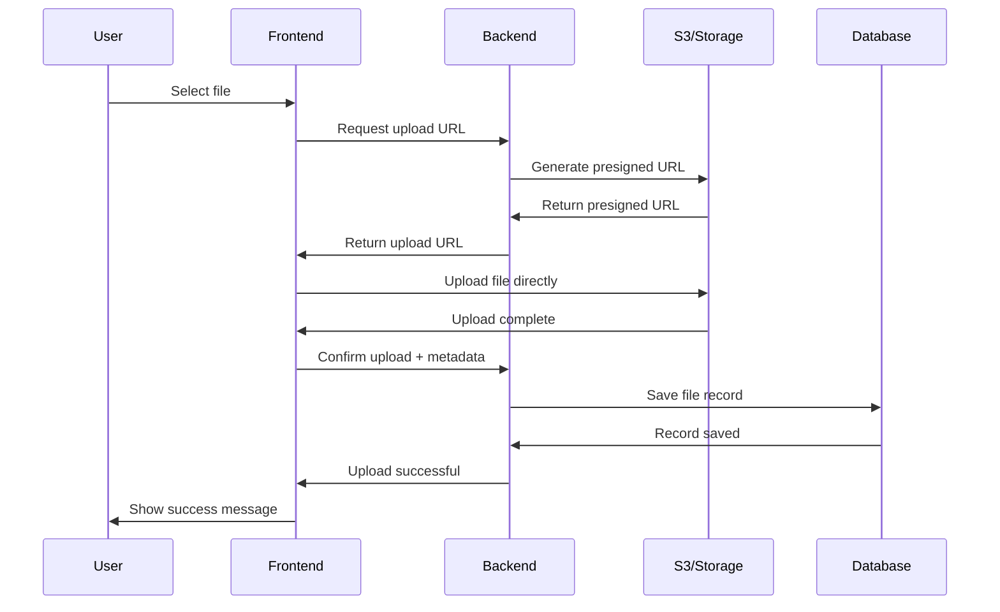

# Mini Meeting - Architecture Diagrams

## System Architecture

## WebRTC Signaling Flow

## Database Schema

## Component Hierarchy (Frontend)

## Request Flow (Backend)

## Meeting Lifecycle

## Deployment Architecture

## File Upload Flow (Future Feature)

